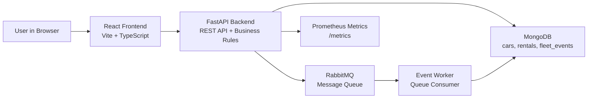
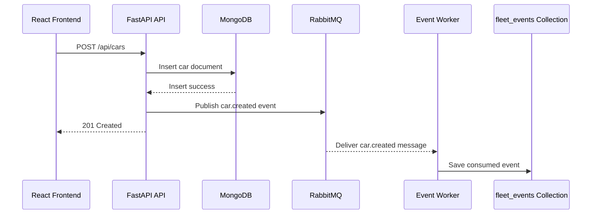
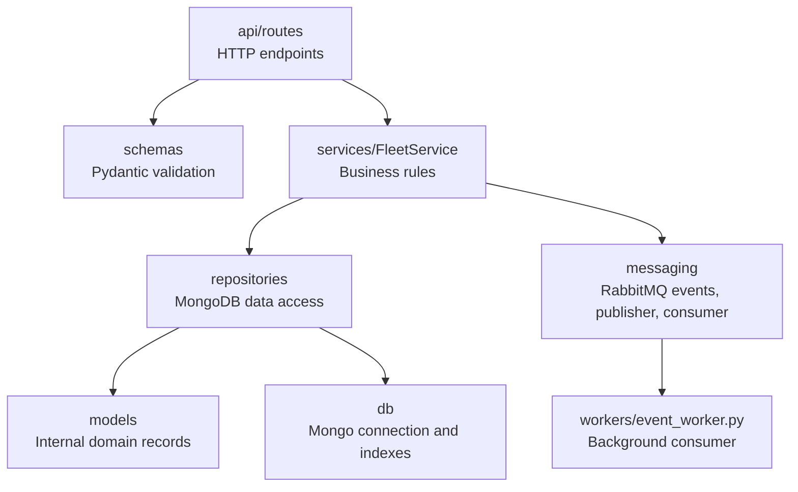
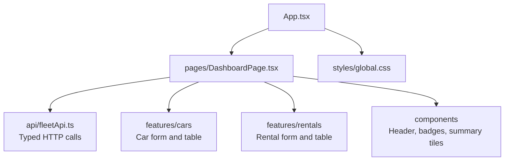
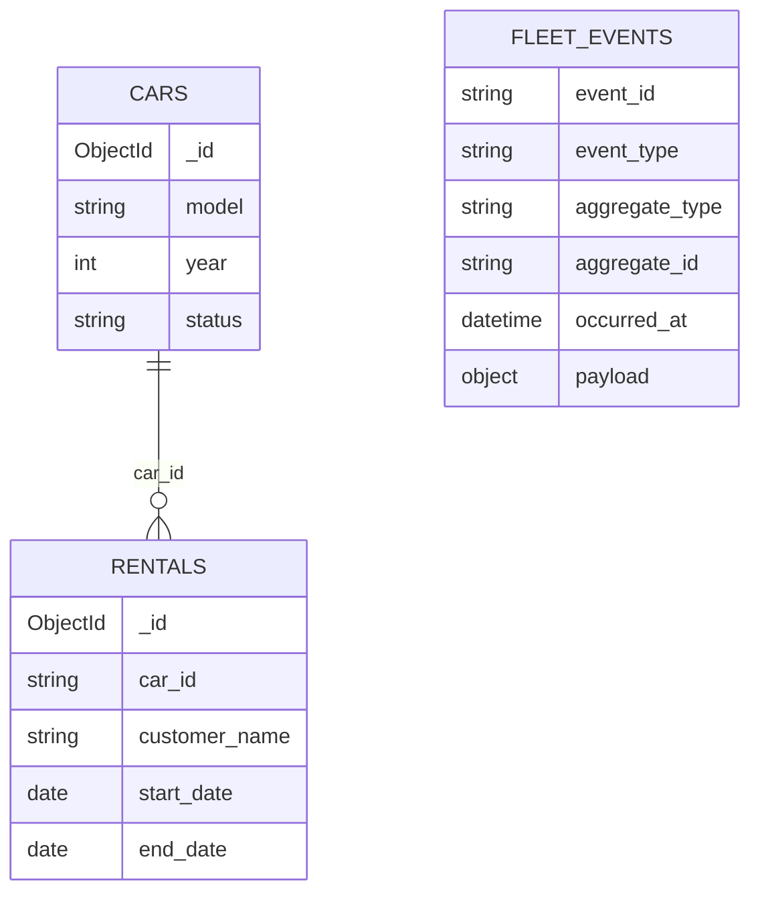
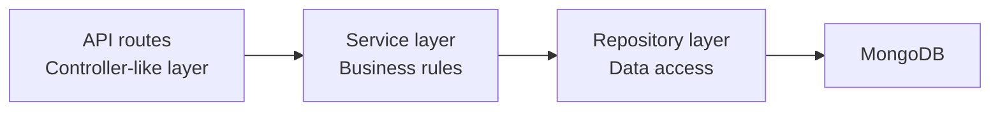
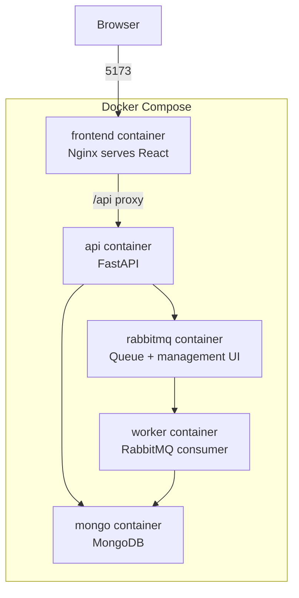
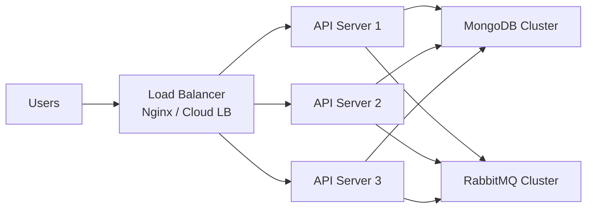
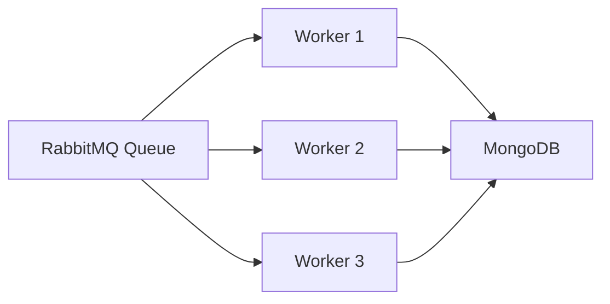
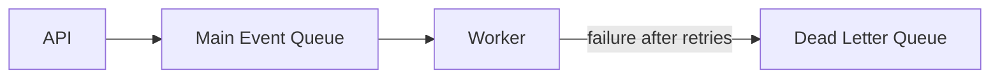

# Rental Fleet Manager - System Design Guide

This document explains how the project works, why the architecture was chosen, how the API is used, how the message queue fits in, and how the system can scale in a more advanced deployment.

## 1. Executive Summary

Rental Fleet Manager is a full-stack car rental management system.

The system has these major parts:

- React frontend: the user interface for adding cars, viewing cars, starting rentals, and ending rentals.
- FastAPI backend: the REST API and business logic layer.
- MongoDB: the NoSQL database that stores cars, rentals, and consumed queue events.
- RabbitMQ: the message queue used for asynchronous communication.
- Event worker: a separate background process that consumes RabbitMQ messages and stores them in MongoDB.
- Docker Compose: runs the whole system locally in a professional multi-service setup.

The most important architecture idea is separation of responsibilities:

- The frontend only handles the user experience.
- The API validates requests and applies business rules.
- MongoDB stores the system state.
- RabbitMQ carries domain events between backend components.
- The worker handles background event processing independently from the user request.

## 2. High-Level Architecture



The frontend communicates with the backend using HTTP REST requests because the browser needs direct request-response actions. The backend then publishes important business events to RabbitMQ. This means the system uses message-queue-based communication for asynchronous backend processing.

## 3. Message Queue Flow

The exercise requirement about communication based on a message queue is handled by RabbitMQ.

When a business action happens, the API publishes a domain event:

- `car.created`
- `car.updated`
- `car.deleted`
- `rental.started`
- `rental.ended`

The event worker consumes those messages and stores them in the `fleet_events` MongoDB collection.



This design is useful because the user does not need to wait for background work. The API can return quickly after the main business operation succeeds, while the worker processes the event independently.

## 4. Why Use RabbitMQ?

RabbitMQ is a message broker. It allows one part of the system to send a message without needing to know exactly when or how another part will process it.

Main advantages:

- Decoupling: the API and worker do not need to run as one process.
- Reliability: messages can be durable, so they can survive restarts.
- Scalability: more workers can be added to process more messages.
- Cleaner responsibilities: API handles user commands, worker handles background processing.
- Better production design: queues are common in real systems for emails, auditing, notifications, reports, and integration with external services.

In this project, RabbitMQ is used as an event pipeline. The API publishes events and the worker consumes them.

## 5. Detailed Backend Architecture



Folder responsibilities:

| Folder | Purpose |
|---|---|
| `backend/app/api/routes` | Defines HTTP endpoints such as `/api/cars`, `/api/rentals`, and `/api/events`. |
| `backend/app/api/dependencies.py` | Creates services and repositories for FastAPI dependency injection. |
| `backend/app/services` | Contains business rules. Example: only available cars can be rented. |
| `backend/app/repositories` | Reads and writes MongoDB collections. |
| `backend/app/schemas` | Request and response models for the API. |
| `backend/app/models` | Internal domain models used by the service and repositories. |
| `backend/app/db` | MongoDB connection, ObjectId helpers, and indexes. |
| `backend/app/messaging` | RabbitMQ event model, publisher, and consumer. |
| `backend/app/workers` | Background worker entry points. |
| `backend/app/core` | Configuration, logging, metrics, and shared errors. |

## 6. Frontend Architecture



The React frontend is organized by feature. This is more professional than putting all UI code into one file.

Important frontend files:

| File | Purpose |
|---|---|
| `frontend/src/pages/DashboardPage.tsx` | Main screen and state management. |
| `frontend/src/api/fleetApi.ts` | Functions that call the backend API. |
| `frontend/src/features/cars/CarForm.tsx` | Form for adding cars. |
| `frontend/src/features/cars/CarsTable.tsx` | Table for viewing and managing cars. |
| `frontend/src/features/rentals/RentalForm.tsx` | Form for starting rentals. |
| `frontend/src/features/rentals/RentalsTable.tsx` | Table for viewing and ending rentals. |

## 7. Database Design

MongoDB collections:



Indexes:

| Collection | Index | Why |
|---|---|---|
| `cars` | `status` | Fast filtering by available, rented, or maintenance cars. |
| `rentals` | `car_id + end_date` | Fast lookup of active rentals for a car. |
| `fleet_events` | `event_id` unique | Prevent duplicate event records if a message is redelivered. |
| `fleet_events` | `occurred_at` | Fast sorting of recent events. |

## 8. Why Choose MongoDB / NoSQL?

MongoDB is a good choice for this project because the data is document-oriented and can evolve over time.

Reasons:

- Flexible schema: car, rental, and event documents can grow without heavy migrations.
- Natural JSON shape: FastAPI and React already work with JSON, and MongoDB stores JSON-like documents.
- Horizontal scaling: MongoDB supports sharding, which can distribute collections across multiple servers.
- High write throughput: useful if the system later receives many rental events, audit messages, or external integrations.
- Event storage: queue events can be saved as flexible documents because different event types may have different payload shapes.

Relational SQL databases are also valid for rental systems, especially when strong joins and transactions are central. In this project, MongoDB is defensible because the system is service-oriented, JSON-based, and event-driven.

## 9. Is MVC Used?

This project does not use classic MVC.

Instead, it uses layered architecture:



FastAPI routes are similar to controllers, but the project separates business rules into `FleetService` and database access into repositories. This is cleaner for backend APIs than forcing a web MVC pattern.

MVC does not conflict with ORM. MVC is an application organization pattern. ORM is a database mapping technique. They solve different problems. This project does not use an ORM because MongoDB is document-based and the code uses repository classes instead.

## 10. API Overview

Base URLs:

- Frontend: `http://127.0.0.1:5173`
- API docs: `http://127.0.0.1:8000/docs`
- API base: `http://127.0.0.1:8000`
- RabbitMQ dashboard: `http://127.0.0.1:15672`

RabbitMQ login:

- Username: `guest`
- Password: `guest`

### Cars

| Method | Endpoint | Purpose |
|---|---|---|
| `POST` | `/api/cars` | Add a new car. |
| `GET` | `/api/cars` | List cars. |
| `GET` | `/api/cars?status=available` | List cars by status. |
| `PATCH` | `/api/cars/{car_id}` | Update car details or status. |
| `DELETE` | `/api/cars/{car_id}` | Delete a car. |

Create car example:

```powershell
Invoke-RestMethod `
  -Method Post `
  -Uri http://127.0.0.1:8000/api/cars `
  -ContentType "application/json" `
  -Body '{"model":"Toyota Corolla","year":2024,"status":"available"}'
```

### Rentals

| Method | Endpoint | Purpose |
|---|---|---|
| `POST` | `/api/rentals` | Start a rental. |
| `GET` | `/api/rentals` | List rentals. |
| `GET` | `/api/rentals?open_only=true` | List only active rentals. |
| `POST` | `/api/rentals/{rental_id}/end?end_date=2026-05-25` | End a rental. |

Start rental example:

```powershell
Invoke-RestMethod `
  -Method Post `
  -Uri http://127.0.0.1:8000/api/rentals `
  -ContentType "application/json" `
  -Body '{"car_id":"CAR_ID_HERE","customer_name":"Dana Levi","start_date":"2026-05-25"}'
```

### Events

| Method | Endpoint | Purpose |
|---|---|---|
| `GET` | `/api/events` | Show recently consumed queue events. |
| `GET` | `/api/events?limit=5` | Show a smaller event list. |

Events prove the message queue is working. If you create a car, the system should create a `car.created` event.

```powershell
Invoke-RestMethod http://127.0.0.1:8000/api/events?limit=5
```

## 11. Business Rules

The service layer protects the system from invalid states.

Important rules:

- A car can be rented only if its status is `available`.
- A car with an active rental cannot be deleted.
- A car with an active rental cannot be manually changed away from `rented`.
- A car cannot be marked as `rented` directly; the rental flow must be used.
- A rental end date cannot be before its start date.

## 12. Logging and Metrics

Logging records what happened in the backend. For example:

- Car added
- Rental started
- RabbitMQ event published
- RabbitMQ event consumed

Metrics expose numeric measurements at:

```text
http://127.0.0.1:8000/metrics
```

Examples:

- Number of backend operations
- Operation duration
- Number of available cars
- Number of rented cars
- Number of open rentals

Metrics are useful because production systems need observability. You do not only want to know that the app works. You want to measure how it behaves over time.

## 13. Docker Runtime Diagram



Run everything:

```powershell
cd C:\Users\User\OneDrive\Desktop\Rental
docker compose up --build
```

Stop everything:

```powershell
docker compose down
```

Reset database and queue data:

```powershell
docker compose down -v
```

## 14. Scaling Plan

The current Docker Compose setup is for local development. In production, the same design can scale.

### Scale the API

Run multiple FastAPI containers behind a load balancer.



Why this helps:

- More users can use the system at the same time.
- If one API server fails, traffic can go to another server.
- API servers are stateless, so they are easy to duplicate.

### Scale the Workers

Run multiple worker containers consuming from the same RabbitMQ queue.



Why this helps:

- More messages can be processed per second.
- Slow background jobs do not block the user-facing API.
- Failed workers can be replaced without stopping the whole system.

### Scale MongoDB

MongoDB can scale with:

- Replica sets: multiple copies of the same data for high availability.
- Sharding: split data across multiple machines for horizontal scaling.
- Indexing: speed up common queries like status filtering and active rentals.

For example, if the company grows to many branches, the `cars` collection could later be sharded by `branch_id` or region.

### Scale RabbitMQ

RabbitMQ can scale with:

- Durable queues
- Multiple consumers
- A RabbitMQ cluster
- Dead-letter queues for failed messages
- Retry queues for temporary failures

Future improvement:



## 15. Suggested Future Improvements

Strong next steps:

- Add authentication and roles: admin, employee, manager.
- Add branches/locations for larger rental companies.
- Add pricing and invoices.
- Add customer records instead of plain customer names.
- Add a reservation flow before rental start.
- Add dead-letter queue handling for failed RabbitMQ messages.
- Add an outbox pattern so database changes and event publishing are guaranteed together.
- Add Grafana dashboards for Prometheus metrics.
- Add CI pipeline in GitHub Actions for tests and builds.
- Deploy with Kubernetes when the project needs many API/worker replicas.

## 16. Best Explanation to Say in a Presentation

Use this short version:

The project is a full-stack rental management system built with React, FastAPI, MongoDB, RabbitMQ, and Docker. React provides the user interface. FastAPI exposes REST endpoints and contains the business logic. MongoDB stores cars, rentals, and consumed queue events. RabbitMQ is used for asynchronous message-queue communication: after important actions, the API publishes domain events such as `car.created` or `rental.started`; a separate worker consumes those events and stores them for audit. This architecture separates the user-facing API from background processing, which makes the system easier to scale. The API can be duplicated behind a load balancer, workers can be scaled independently, MongoDB can use replica sets and sharding, and RabbitMQ can distribute messages across multiple consumers.
